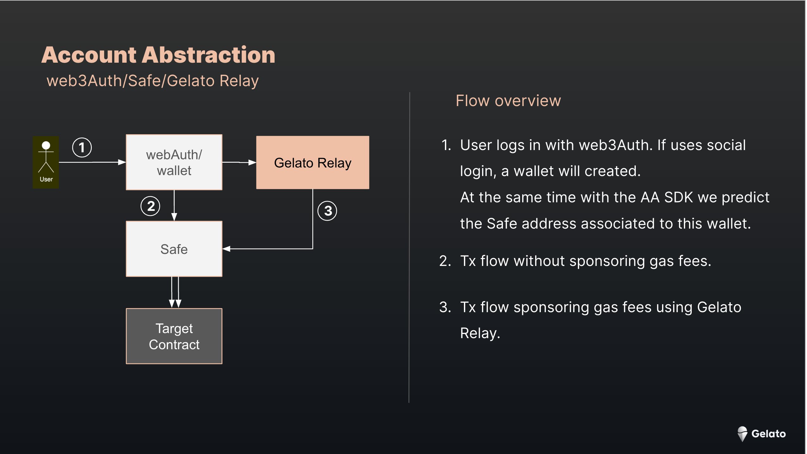
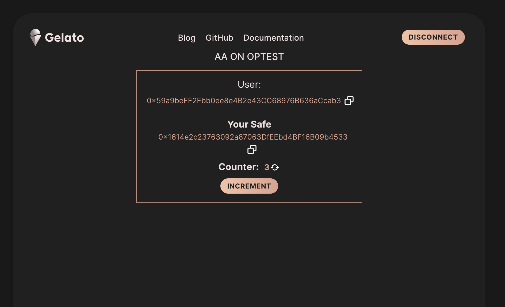

# Gelato Raas Account Abstraction

This repo contains the approach to Account Abstraction (AA) on Gelato Raas. 
For the time being we have deployed one solution for AA using web3Auth, Safe and Gelato Relay. However, moving forward we will add other solutions.  

## Web3Auth / Safe / Gelato Relay

### SDKs
---
Following SDKs are required
| Package| SDK |
| --- | ----------- |
| web3Auth | @web3auth/modal |
| Safe Protocol Kit | [gelato-raas-protocol-kit](https://www.npmjs.com/package/gelato-raas-protocol-kit)|
| Safe AA Kit | [gelato-raas-account-abstraction-kit](https://www.npmjs.com/package/gelato-raas-account-abstraction-kit)|
| Safe Relay Kit | [gelato-raas-relay-kit](https://www.npmjs.com/package/gelato-raas-relay-kit)|

The packages `gelato-raas-account-abstraction-kit`, `gelato-raas-relay-kit` implement under the hood the custom packages `gelato-raas-protocol-kit` and ` gelato-raas-safe-deployments`

We have prepared two starter kits to get up and running. One with a React UI implementation and the second with a backend implementation  

## AA UI Starter Kit  
 A project showcasing a React implementation of how to use web3Auth with Safe and Gelato on Gelato Raas.

 [https://gelato-raas-op-ui.web.app/](https://gelato-raas-op-ui.web.app/)

  

Please visit the [UI Starter Kit repo](https://github.com/gelatodigital/gelato-raas-op-ui-starter)

## AA &  Gelato Starter Kit
In this project we showcase how to implement Account Abstraction and gasless transactions with Safe and help to get started with OpTest.
Please visit the [AA Gelato Starter Kit](https://github.com/gelatodigital/gelato-raas-op-starter)

## Ressources
[web3Auth docs](https://web3auth.io/docs)  
[Safe docs](https://docs.safe.global/getting-started/readme)  
[Gelato Relay docs](https://docs.gelato.network/developer-services/relay)  

[gelato-raas-protocol-kit](https://www.npmjs.com/package/gelato-raas-protocol-kit)  
[gelato-raas-account-abstraction-kit](https://www.npmjs.com/package/gelato-raas-account-abstraction-kit)  
[gelato-raas-relay-kit](https://www.npmjs.com/package/gelato-raas-relay-kit)  
